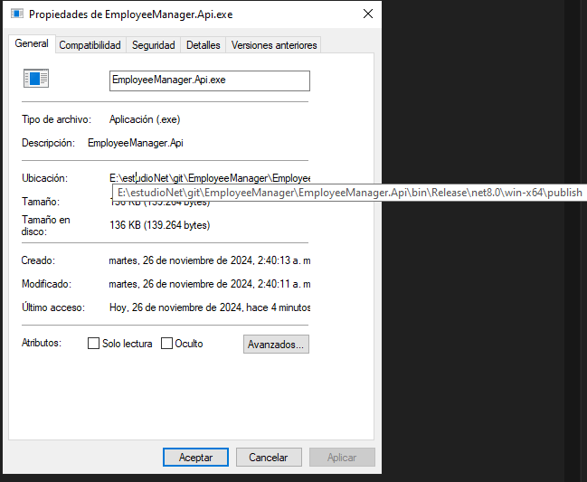

# EmployeeManager

## Building the project
1. Ensure you are in the root of the solution folder. Verify the root directory as shown in the screenshots below  
  
  

2. build the solution  
  
  

3. Publish the project as an executable starting from the Api project.  
  
-c Release specifies that the app will be released with the release configuration  
-r win-x64 specifies the target runtime, can be changed to linux-x64 or osx-x64 as required  
--self-contained specifies that all required dependencies will be included in the executable   

4. verify executable, it will be located into EmployerManager.Api/bin/Release/net8.0/{runtime}/publish  
  

5. run the executable  
  

6. test as needed  
  
  
  

optional:  
If you prefer not to build the entire project into an executable, you can run and test the code directly within Visual Studio.  
  
run the https profile  
  
verify it started correctly  
  
access Swagger  
  